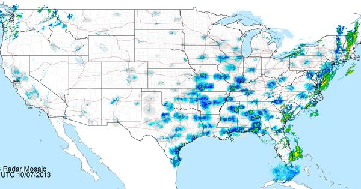
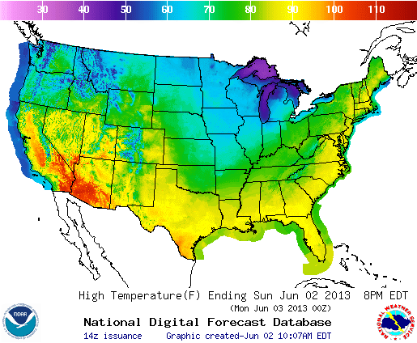
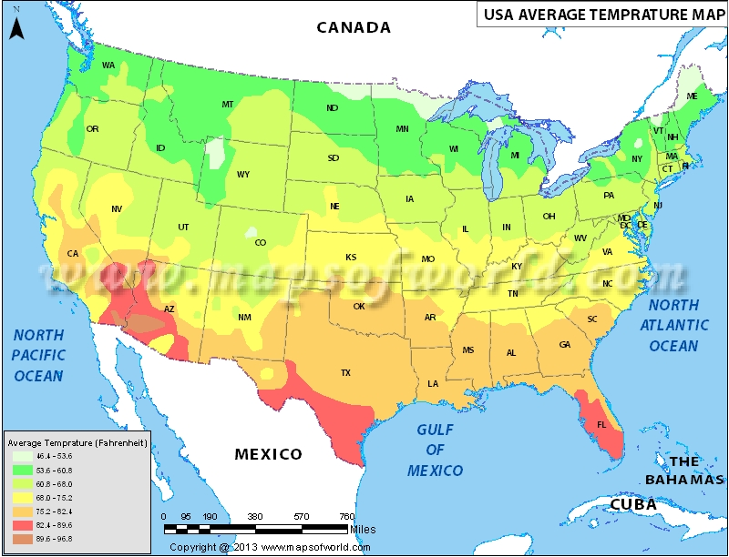

# WeatherViz - Interactive Weather Map

## Local setup

- create `src/config.py` and add these variables

        USER = 'admin'
        PASSWORD = 'password2'

- create `src/static/config.js` and add these variables

        API_KEY = '<mapbox_key>'
        CLIENT_ID = '<aeris_key>'
        CLIENT_SECRET = '<aeris_secret>'

- Run `python app.py` and navigate to `localhost:5000/home` in your browser

#

## Interactive Weather Map

## Topic: Allow a user to view the average temperature, accumulated rainfall, or accumulated snowfall for the United States over a user-defined period of time.

### On top of the heatmaps in this document, the goal would be to include either drop-downs or free-entry input boxes for a user to enter a range of dates. When the user clicks submit, the page will reload and the heatmap will change (or if there is a way for us to make it so that the user can adjust a sliding bar filter and the heatmap change without having to reload the page, that would be ideal).

### Source of data: OpenWeatherMap API (https://openweathermap.org/history#city)

### Link to repository: https://github.com/andywats0n/gtdata_project2

## Examples

### Precipitation

### Temperature

### Another temperature

